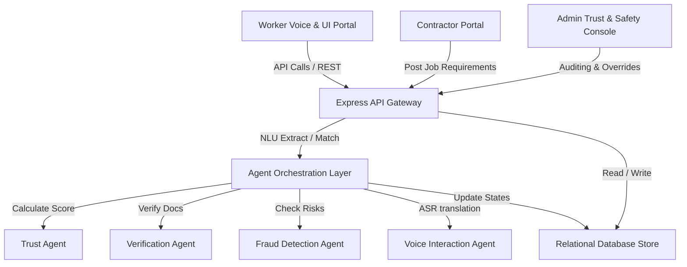

# LabourLink System Architecture

LabourLink is an agentic trust infrastructure for India's informal workforce. It provides portable, verifiable, contractor-independent trust identities by managing transactions and calculating trust scores using SQL audit traces and active multi-agent flows.

## Component Overview

## Relational Database Design
We use a relational database structure backed by a pure JS SQLite storage adapter for complete build independence on target Windows/Node platforms. Distances are computed directly in SQL queries via registered Haversine formulas. Bounding boxes pre-filter spatial candidate sets to ensure high query performance.

## Agent Orchestration
1. **Voice Interaction Agent**: Normalises speech inputs (using Web Speech API text) into intent actions and parameters by cross-checking against unique skills and locations stored in the database.
2. **Requirement Extraction Agent**: Parses contractor postings to structure urgency, skills, payroll limits, and geographic coordinates.
3. **Worker Matching Agent**: Filters candidate pools on availability, checks bounding-box spatial grids, matches skills, and scores candidates.
4. **Fraud Detection Agent**: Analyzes ratings, locations, session fingerprints, and payments to record fraud flags.
5. **Trust Agent**: Evaluates worker histories to update indexes from 0 to 100.
6. **Recommendation Agent**: Consolidates matches, trust indicators, and fraud signals to produce detailed, evidence-cited worker summaries.
